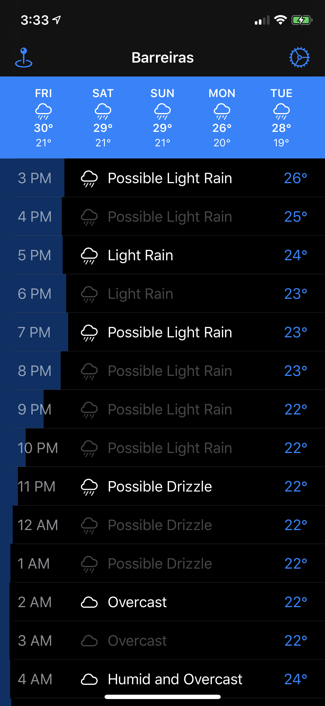
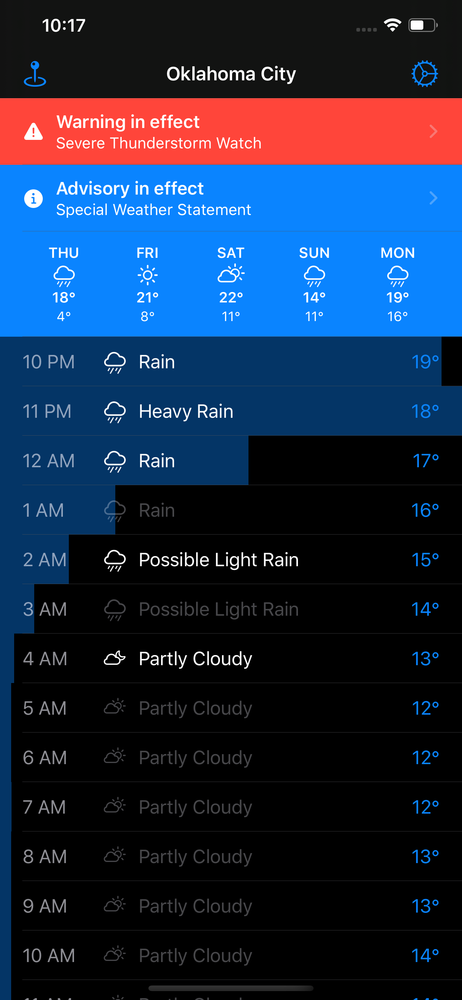
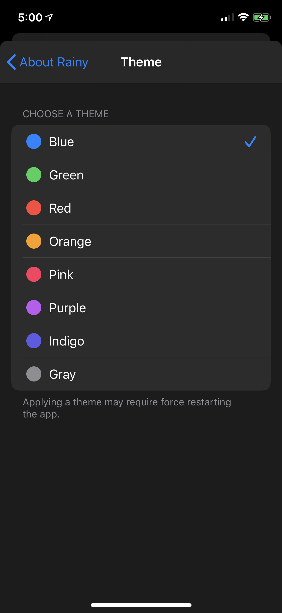

# Rainy for iOS ☔️
  

☔️ Rainy is a nice-looking, rain-oriented weather app for iOS, written in Swift. Basically, the ideal tool if you live in a place like Vancouver. Currently available for download [on the iOS App Store](https://itunes.apple.com/fm/app/rainy-rain-forecasts/id1312152536).

Rainy is über-cool because:

- It is light on your iPhone/iPad/iNextThingy. The entire source code + image and font assets package is only 1.2 MB, saving space on your iOS device.
- It has a pretty privacy-aware API! Rainy fetches your weather from a caching and clustering proxy written in Go and managed by me. It is hosted on Heroku at `https://api.rainyapp.com`. This means that your queries are aggregated with other Rainy users, so DarkSky.net cannot know who is asking for which location. This also allows me to reduce costs as I can aggregate multiple queries for the same location by caching results that are still recent, reusing them across users.
- It is GDPR-compliant! Meaning: it merely performs a single HTTPS request to get your weather. No BS, no analytics frameworks, no advertisements, no pinging unknown Chinese ad networks that deliver personalized noodles recommendations. 🍜 [Version 2.0 adds Sentry.io, but it is exclusively opt-in, and disabled by default.] 

The app was open-sourced on September 3rd, 2018.
